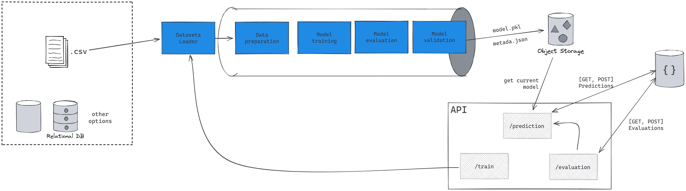

# API Prices Prediction
Hi there, 

With inflation rates rising from wind to wind, we will never know what the price of basic supplies will be. Every trip to the market is a new surprise. Or can we figure this out somehow and plan for it?

Well, if you live in Chile, and you accept a mathematical model that predicts basic supplies (just milk for now) with a relatively high margin of error, this repository is for you.

Joking aside, this repo contains a demonstration of a way of taking predictive models into a production environment.

# Considerations

Let's start with what I couldn't achieve in an available time:

* **Connect CassandraDB to the API:** I wanted to connect the database to the API so I could save all predictions and evaluations, so I could have better monitoring of my model
* **Logging system:** I didn't implement a very robust logging system.
* **GET routes:** as I didn't connect the database to the API, I couldn't enable the GET routes.
* **Experimental dashboard:** I found a very cool repo, [Optuna](https://github.com/optuna/optuna), which is an automatic hyperparameter optimization software framework, particularly designed for machine learning.

Could be better:

* **Pipelines dynamics:** I had some trouble configuring the pipelines, I think it is possible to improve the code organization, so it becomes more modularized and reusable.
* **Async tasks:** I couldn't manage how to create async tasks. My goal was to return the model_uuid in the `/models/train` route, so the user could get the model metadata later with the UUID.

Well, what this repo implements well:

* **Fast predictions:** Is very quick to make a new prediction.
* **Evaluations:** with the evaluation route, it is possible to check how the model is performing, and save more data that can be used in model training in the future.

---

## Make it run

Said that, let's do it! 

First of all, clone this repo

```Bash
git clone git@github.com:molinavinicius/ml_eng_challenge.git
```

Then, run

```Bash
cd ml_eng_challenge && docker build -t prices_api_image .
```

Psiu, please don't forget the `.` (dot) in the end, it is saying to Docker build the image from the current directory.

After Docker installs all the packages, run:
```Bash
docker run -d --name prices_api_container -p 80:80 prices_api_image
```

Now, you have the API up and running. Please, start by accessing the API documentation on [https://localhost:80/docs].

In the API docs, you'll be able to see all the implemented endpoints, and what data send to use these endpoints.

---

## Deep dive

This application has two principal folders: 

* `core`, and
* `ml`

The `core` folder is responsible for all sorts of configurations on the API, including the schemas, FastAPI settings (using pydantic), and database stuff (not implemented yet).

On the other hand, the `ml`, which stands for Machine Learning, contains the classes and functions responsible for making the predictions, evaluations, and models pipeline training.

Figure 1 below shows the general organization of the application components:


</p>
<p align = "center">
<b>Fig. 1.</b> Architecture Sketch
</p>

When the application starts it needs two things: the current model and a training pipeline. As shown in Figure 1, the current model is loaded from an Object Store, in fact, in this application, it is being stored on disk. For production purposes, it is advised to use a cloud object storage, such as AWS S3, GCP Cloud Storage, or others. This way, it is possible to have two APIs, one for training and the other for prediction, communicating through the object storage.

When making a `POST` request to the endpoint `/predictions`, the `AIModel` instance transforms the input data into a format that is expected by the model and then makes a prediction.

The endpoint `evaluations` uses the `AIModel.predict` function, and then compares the result with the expected values. With this, the instance can calculate metrics of interest. 